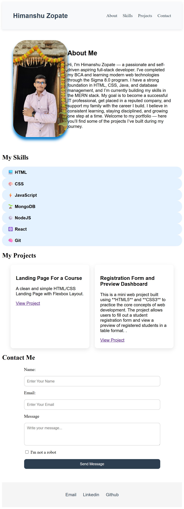

💼 (Beginer Level) Personal Portfolio Website 

Welcome to my personal portfolio website! I'm **Himanshu Zopate**, a passionate and self-driven Full Stack Developer, currently pursuing BCA and preparing for MCA. I built this website to showcase my skills, projects, and journey as I work towards getting placed in a reputed tech company.

 🧠 About Me

 I'm committed to learning and growing every day. This portfolio reflects my dedication, discipline, and continuous learning — built completely using **HTML5** and **CSS3** (so far 😄).

 🔧 Technologies Used

- HTML5
- CSS3
- Flexbox Layout
- Google Fonts
- Responsive Design Principles

 📂 What You'll Find

- **About Me** section
- **Skills** listed with Flexbox
- **Projects** with live links
- **Contact Form** (frontend only)
- Clean and responsive UI

 📸 Preview

  

🔗 Live Preview

Check it out live here: [Portfolio Website](https://himanshuzopate.github.io/portfolio-website)

📬 Contact

- **Email**: [himanshuzopate@gmail.com](mailto:himanshuzopate@gmail.com)  
- **LinkedIn**: [Himanshu Zopate](https://linkedin.com/in/himanshu-zopate-0b107829a)  
- **GitHub**: [@HimanshuZopate](https://github.com/HimanshuZopate)

> ✨ This is just the beginning. I’m learning new tools every day and will keep updating this portfolio. Your feedback is always welcome!

